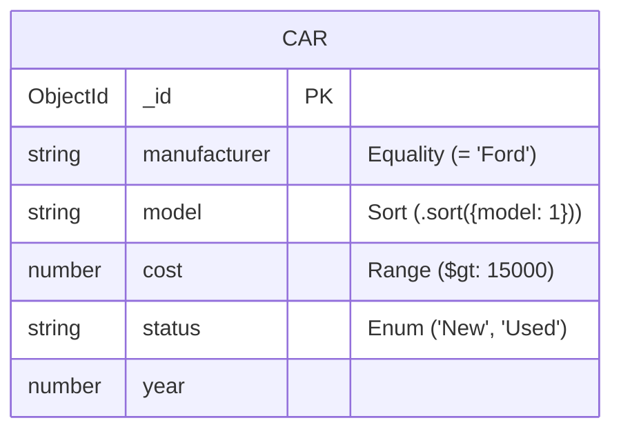

# Otimização de Performance (Regra ESR) 🏎️

Bem-vindo ao Laboratório Prático da Regra **Equality, Sort, Range**.
Aqui você abandona os slides e testa na prática por que a ordem de um índice composto faz a diferença entre sua API responder em 1 milissegundo ou estourar a memória RAM do servidor.

## 📚 Sumário de Documentação

- 🏗️ **[Modelagem e Arquitetura Mongoose (`architecture.md`)](./architecture.md)**
- 📝 **[Definição do Schema TS (`src/schemas/CarSchema.ts`)](./src/schemas/CarSchema.ts)**
- 🌱 **[Script Gerador de Massa (`src/seed.ts`)](./src/seed.ts)**
- 🚀 **[Mini-API Express (`src/server.ts`)](./src/server.ts)**

---

## 📊 Estrutura da Coleção



---

## 🧪 Como Rodar e Testar

Este laboratório é um servidor Node.js escrito em TypeScript.

### 1. Configurar o `.env`
Renomeie o arquivo `.env.example` para `.env` e coloque a sua *Connection String* do MongoDB:
```bash
MONGO_URI=mongodb+srv://<user>:<pass>@<cluster>...
PORT=3001
```

### 2. Injetar a Massa de Dados
Você precisa de milhares de documentos para o índice "sofrer".
```bash
npm run seed
```

### 3. Rodando com Swagger UI (A Forma Visual)
Suba o servidor e acesse a interface visual:
```powershell
.\run_server.ps1
```
Acesse no navegador: **[http://localhost:3001/api-docs](http://localhost:3001/api-docs)**. 
Pelo Swagger você pode inspecionar o Schema dos carros, ler as documentações e apertar no botão **"Try it out"** para disparar os endpoints de teste dos índices.

### 4. Rodando Bateria de Testes (A Forma Automatizada)
Criamos arquivos de teste usando o **Jest** (`tests/api.test.ts`) que vão direto no banco de dados e provam se a Regra ESR evitou ou não o desastroso *In-Memory Sort*.
```powershell
.\run_tests.ps1
```
