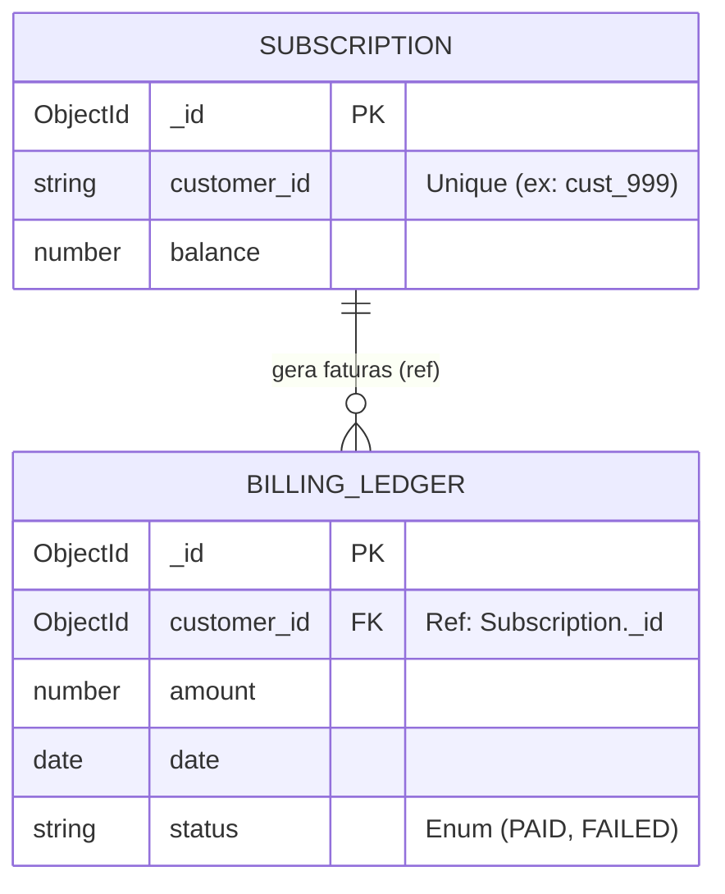

# Cenário Real: BillLens (Transações ACID) 💸

Bem-vindo ao Laboratório Prático de Transações Multi-Documento (ACID) usando o Mongoose (TypeScript).
Neste cenário, se uma falha de sistema ocorrer antes do término de um pagamento duplo, o MongoDB reverte o processo, garantindo que "ou tudo acontece, ou nada acontece".

## 📚 Sumário de Documentação

- 🏗️ **[Modelagem e Arquitetura Mongoose (`architecture.md`)](./architecture.md)**
- 📝 **[Definição do Schema Subscriptions (`src/schemas/SubscriptionSchema.ts`)](./src/schemas/SubscriptionSchema.ts)**
- 📝 **[Definição do Schema Ledger (`src/schemas/LedgerSchema.ts`)](./src/schemas/LedgerSchema.ts)**
- 🚀 **[Mini-API Express (`src/server.ts`)](./src/server.ts)**

---

## 📊 Estrutura Relacional Mongoose



---

## 🧪 Como Rodar e Testar

Este laboratório roda um servidor Node.js (TypeScript) que simula o Webhook de um Gateway de Pagamentos.

### 1. Configurar o `.env`
Renomeie o arquivo `.env.example` para `.env` e coloque a sua *Connection String* do MongoDB. Como testaremos transações ACID, **o seu banco de dados DEVE ser um Replica Set** (Qualquer cluster gratuito do Atlas já é).
```bash
MONGO_URI=mongodb+srv://<user>:<pass>@<cluster>...
PORT=3002
```

### 2. Rodando com Swagger UI (A Forma Visual)
Suba a aplicação com o script PowerShell:
```powershell
.\run_server.ps1
```
*(O Mongoose conectará ao banco e injetará $100 de saldo na conta do cliente).*

Acesse a interface visual em **[http://localhost:3002/api-docs](http://localhost:3002/api-docs)**.

Pelo Swagger você pode:
* Ver seu saldo inicial nas rotas GET.
* Apertar "Try it out" na transação de sucesso (E ir checar o ledger).
* Apertar "Try it out" na transação simulando falha de rede (E ir checar o saldo intacto).

### 3. Rodando a Bateria de Testes (Automatizado via Jest)
Nós criamos o script `tests/api.test.ts`. Quando executado, ele sobe em memória, ataca os endpoints e verifica debaixo dos panos diretamente na Collection do MongoDB se ocorreu *Dirty Write* ou se a transação do banco agiu isoladamente.
```powershell
.\run_tests.ps1
```
